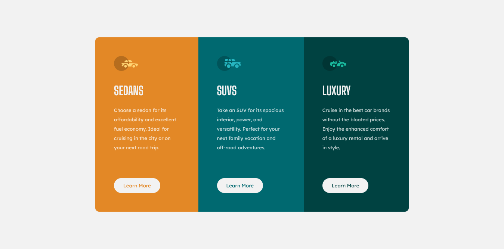

# Frontend Mentor - 3-column preview card component solution

This is a solution to the [3-column preview card component challenge on Frontend Mentor](https://www.frontendmentor.io/challenges/3column-preview-card-component-pH92eAR2-). Frontend Mentor challenges help you improve your coding skills by building realistic projects. 

## Overview

### Screenshot

### Links

- Solution URL: [Github](https://johnsmith081.github.io/3-column-preview-card/)
- Live Site URL: [Add live site URL here](https://johnsmith081.github.io/3-column-preview-card/)

### Built with

- HTML5
- CSS

### Continued development

Advanced HTML and CSS properties, javascript

## Author

- GitHub repo - [Johnsmith081](https://github.com/johnsmith081)
- Frontend Mentor - [@Johnsmith](https://www.frontendmentor.io/profile/johnsmith081)

